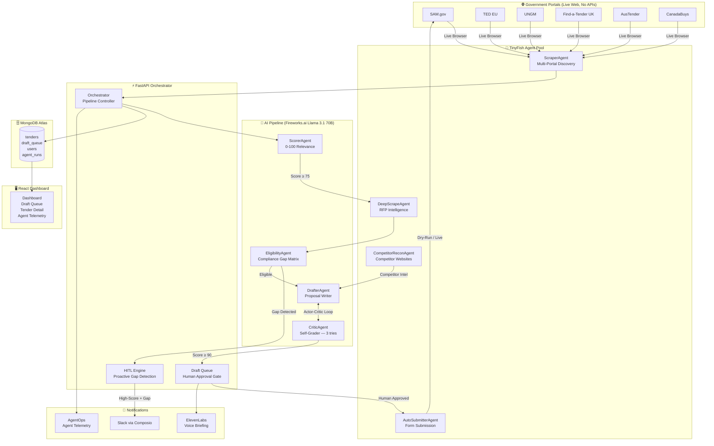

# TenderBot Global 🌐
> **The world's first fully autonomous AI procurement swarm.**  
> TenderBot monitors the **$500B+ global government procurement market**, qualifies bids, self-corrects proposals, and takes live action on validated opportunities — with zero human initiation.

Built for the **TinyFish $2M Pre-Accelerator Hackathon 2026**.

[](https://tinyfish.ai)
[](https://fastapi.tiangolo.com)
[](https://mongodb.com/atlas)
[](https://fireworks.ai)
[](https://composio.dev)
[](https://elevenlabs.io)
[](https://agentops.ai)
[](https://vercel.com)

---

## The Problem

> Companies bidding on government contracts spend **$30,000–$80,000/month** on human bid teams that still miss crucial deadlines, overlook compliance requirements, and submit sub-optimized proposals against unknown competitors.

The result? Win rates under 15% on a market with **$500B+ in annual procurement opportunities** on portals like SAM.gov, TED EU, and UNGM — **none of which have public APIs.**

---

## The Solution

TenderBot is an **autonomous multi-agent swarm** that replaces the repetitive, error-prone parts of the bid pipeline entirely:

| Phase | What TenderBot Does |
|---|---|
| **Discovery** | TinyFish agents scrape 6 live government portals in parallel |
| **Intelligence** | Fireworks LLM scores every tender 0–100 against company profile |
| **Qualification** | Deep-scrape + AI eligibility analysis: *"8/10 criteria met; missing ISO 27001"* |
| **Drafting** | Actor-Critic Agent self-corrects proposals across 3 iterations until Critic gives >90/100 |
| **Action** | Auto-Submitter TinyFish agent physically navigates portals and stages form submissions |
| **Human Gate** | HITL: Blocked tenders trigger Slack alerts; humans approve or grant exemption waivers |
| **Memory** | Win/Loss feedback loop trains the relevance scorer over time |

---

## Live Architecture



---

## 4 Advanced Agentic Features (Hackathon Core)

### 1. 🚀 Auto-Submitter Action Agent
TinyFish agent that autonomously navigates to a government portal, locates the submission form, injects the proposal draft field-by-field, and stages the complete application for human confirmation.
- **Safety:** `ENABLE_LIVE_SUBMIT=False` dry-run mode prevents any live clicks until explicitly enabled.
- **File:** `backend/agents/auto_submitter.py`

### 2. 🕵️ Multi-Step Competitor Recon Agent
When a high-scoring tender is discovered, TinyFish spawns sub-agents that search Google for known competitors, visit their websites, scrape their tech stack and value propositions, and return structured competitive intelligence.
- This data is injected directly into the DrafterAgent to generate a **"Why Choose Us vs. Competitor X"** section.
- **File:** `backend/pipelines/competitor_intel.py`

### 3. 🔄 Actor-Critic Self-Refinement Loop
The DrafterAgent writes a proposal, then an internal CriticAgent strictly grades it (0–100) against the tender's eligibility requirements. If below 90, the critique is fed back into the next iteration. This runs up to **3 times**, guaranteeing a self-correcting, compliance-aware bid document.
- **File:** `backend/pipelines/auto_drafter.py`

### 4. 🛑 Proactive Human-in-the-Loop Clarification
When a tender scores ≥ 80 but has an **unresolvable compliance gap** (e.g., a missing certification the company cannot claim), the pipeline halts, fires a `clarification_needed` Slack alert via Composio, and marks the bid as 🛑 **Blocked** in the Draft Queue — prompting the human operator to either abort or grant an exemption waiver.
- **File:** `backend/pipelines/orchestrator.py`, `frontend/components/DraftQueue.tsx`

---

## Tech Stack

| Layer | Technology | Why |
|---|---|---|
| **Web Agent** | TinyFish Web Agent API | Only way to access portals with no public APIs |
| **LLM** | Fireworks.ai — Llama 3.1 70B | Fast, cheap, structured JSON outputs |
| **Database** | MongoDB Atlas + Motor | Async document store for semi-structured tender data |
| **Alerts** | Composio → Slack + Email | Zero-config Slack integration for HITL alerts |
| **Voice** | ElevenLabs TTS | Daily voice briefing for mobile accessibility |
| **Monitoring** | AgentOps | Per-agent run tracing, error rates, latency |
| **Backend** | FastAPI + APScheduler | Async REST API + cron-based autonomous pipeline |
| **Frontend** | Next.js + Vercel v0 | React dashboard with real-time agent telemetry |

---

## Project Structure

```
tenderbot/
├── backend/
│   ├── main.py               # FastAPI app, CORS, router mounts
│   ├── config.py             # All settings from .env (pydantic-settings)
│   ├── scheduler.py          # APScheduler: daily scrape + watchdog + briefing
│   ├── agents/
│   │   ├── auto_submitter.py # 🆕 Feature 1: TinyFish Action Agent
│   │   ├── deep_scrape.py    # RFP detail scraper
│   │   ├── amendment.py      # Live amendment monitor
│   │   └── sam_gov.py        # Portal-specific agents
│   ├── pipelines/
│   │   ├── orchestrator.py   # Master pipeline controller + HITL logic
│   │   ├── auto_drafter.py   # 🆕 Feature 3: Actor-Critic loop writer
│   │   ├── competitor_intel.py # 🆕 Feature 2: Competitor Recon Agent
│   │   ├── eligibility.py    # 🆕 Feature 4: HITL gap detection
│   │   ├── scorer.py         # LLM relevance scorer
│   │   └── rfp_researcher.py # Eligibility extractor
│   ├── routers/
│   │   ├── tenders.py        # GET/POST tenders, approve-draft, submit
│   │   ├── scrape.py         # POST /scrape trigger
│   │   ├── profile.py        # Company profile CRUD
│   │   └── health.py         # Health check
│   └── services/
│       ├── db.py             # MongoDB Motor async client
│       ├── alerts.py         # Composio Slack/email dispatch
│       ├── deadline_watchdog.py  # Deadline proximity alerts
│       └── outcome_tracker.py   # Win/Loss feedback loop
├── frontend/
│   ├── app/                  # Next.js App Router pages
│   └── components/
│       ├── Dashboard.tsx     # Main dashboard with tab navigation
│       ├── DraftQueue.tsx    # 🆕 Blocked/Waiver UI for HITL
│       ├── TenderDetail.tsx  # Full tender detail + Submit button
│       └── AgentTelemetry.tsx  # Live pipeline event feed
├── .env.example              # ← Start here
├── requirements.txt
├── Procfile                  # Railway: uvicorn backend.main:app
└── README.md
```

---

## Quick Start (1-Command Setup)

### Prerequisites
- Python 3.10+
- Node.js 18+
- A free [MongoDB Atlas](https://cloud.mongodb.com) cluster

```bash
# 1. Clone
git clone https://github.com/yourusername/tenderbot-global.git
cd tenderbot-global

# 2. Backend
python -m venv venv && venv\Scripts\activate   # Windows
# source venv/bin/activate                     # Mac/Linux
pip install -r requirements.txt

# 3. Environment
cp .env.example .env       # Then fill in your API keys

# 4. Start backend
uvicorn backend.main:app --reload --port 8000

# 5. Start frontend (new terminal)
cd frontend && npm install && npm run dev
```

Open `http://localhost:3000` to see the dashboard.  
Open `http://localhost:8000/docs` for interactive API docs.

---

## Production Safeguards (Tier 1)

| Safeguard | Where | Impact |
|---|---|---|
| **LLM Context Truncation** | `auto_drafter.py:86` | Prevents 200-page PDFs from crashing the LLM with OOM token errors |
| **Atomic DB Upserts** | `auto_drafter.py:44` | `$setOnInsert` prevents duplicate drafts from concurrent cron jobs |
| **Action Agent Dry-Run** | `auto_submitter.py:60` | `ENABLE_LIVE_SUBMIT=False` blocks the submit button until explicitly enabled |

---

## API Reference

| Method | Endpoint | Description |
|---|---|---|
| `GET` | `/health` | Agent health + per-portal status |
| `POST` | `/profile` | Save / update company profile |
| `GET` | `/profile/{company}` | Retrieve profile |
| `POST` | `/scrape` | Trigger full multi-portal discovery |
| `GET` | `/tenders` | List tenders with score/status filters |
| `GET` | `/tenders/{id}` | Full tender detail + eligibility matrix |
| `POST` | `/tenders/{id}/draft` | Generate one-off proposal draft |
| `POST` | `/tenders/{id}/approve-draft` | Approve / Reject / Revise / Waiver |
| `POST` | `/tenders/{id}/submit` | Launch Auto-Submitter Action Agent |
| `POST` | `/tenders/{id}/outcome` | Record win/loss for feedback loop |
| `GET` | `/queue/drafts` | Draft approval queue |
| `GET` | `/briefing/audio` | ElevenLabs daily voice briefing |

---

## Deployment

```bash
# Backend → Railway (auto-detects Procfile)
railway up

# Frontend → Vercel
cd frontend && vercel --prod
```

Set all `.env` variables in your Railway and Vercel dashboard.

---

## Market Opportunity

| Metric | Value |
|---|---|
| Global gov. procurement market | **$500B+/year** |
| Share awarded via public portals | **~70%** |
| Average company win rate (manual) | **< 15%** |
| TenderBot target win rate improvement | **2–3x** |
| Serviceable market (SMBs + mid-market) | **$12B** |

---

## Hackathon Compliance

✅ **TinyFish Web Agent API** is the core browser infrastructure (portals have zero public APIs)  
✅ **No mock data** — all scraped from live SAM.gov, TED EU, UNGM portals  
✅ **Multi-step agentic work**: Scrape → Score → Qualify → Compete → Draft → Critique → Submit  
✅ **Partner stack**: TinyFish · Fireworks.ai · MongoDB · Composio · ElevenLabs · AgentOps · Vercel  

---

*Made with ❤️ for the TinyFish $2M Pre-Accelerator Hackathon 2026*
