# Task 2.1 — System Architecture (Locked)

> **Status:** FROZEN for v1 hackathon build.  
> **Rule:** No architectural changes without updating this document first.  
> **This file becomes the "Architecture" section of the project README.**

---

## 1. High-Level Architecture Diagram

```mermaid
graph TB
    %% ── USER LAYER ──────────────────────────────────────────
    subgraph UL["🖥️  USER LAYER  (Vercel)"]
        P["Company Profile\nOnboarding Form"]
        D["React Dashboard\nTender List"]
        TD["Tender Detail View\n(Score · Eligibility · Amendments)"]
        AL["Alerts Center"]
        HL["Health Status Page"]
        VP["Voice Briefing Player"]
    end

    %% ── API LAYER ───────────────────────────────────────────
    subgraph API["⚙️  API LAYER  (FastAPI · Railway)"]
        R1["POST /profile"]
        R2["POST /scrape"]
        R3["GET  /tenders"]
        R4["GET  /tender/:id"]
        R5["POST /alerts/config"]
        R6["GET  /health"]
        R7["GET  /briefing/audio"]
        R8["POST /auto-fill"]
    end

    %% ── ORCHESTRATION ───────────────────────────────────────
    subgraph ORC["🔀  ORCHESTRATION LAYER"]
        SC["Async Scrape\nCoordinator\nasyncio.gather"]
        SP["Scoring\nPipeline"]
        SCHED["APScheduler\nCron Jobs"]
        AM["Alert\nManager"]
    end

    %% ── TINYFISH AGENT POOL ─────────────────────────────────
    subgraph TF["🐟  TINYFISH AGENT POOL  (Core Infrastructure)"]
        A1["SAM.gov\nAgent"]
        A2["TED EU\nAgent"]
        A3["UNGM\nAgent"]
        A4["Find-a-Tender\nAgent"]
        A5["AusTender\nAgent"]
        A6["CanadaBuys\nAgent"]
        DS["Deep RFP\nScraper Agent"]
        AMT["Amendment\nTracker Agent"]
        FF["Form-Fill\nAgent"]
    end

    %% ── LLM LAYER ───────────────────────────────────────────
    subgraph LLM["🧠  LLM LAYER  (Fireworks.ai · Llama 3.1 70B)"]
        SC2["Relevance\nScorer"]
        EL["Eligibility\nAnalyser"]
        CI["Competitor\nIntel (stretch)"]
        AD["Amendment\nDiff (stretch)"]
    end

    %% ── DATA LAYER ──────────────────────────────────────────
    subgraph DB["🗄️  DATA LAYER  (MongoDB Atlas)"]
        T["tenders\ncollection"]
        U["users\ncollection"]
        PL["portal_logs\ncollection"]
        ALT["alerts\ncollection"]
    end

    %% ── NOTIFICATION LAYER ──────────────────────────────────
    subgraph NL["🔔  NOTIFICATION LAYER"]
        SL["Composio\nSlack"]
        EM["Composio\nEmail"]
        EV["ElevenLabs\nVoice"]
    end

    %% ── MONITORING LAYER ────────────────────────────────────
    subgraph ML["📊  MONITORING LAYER"]
        AO["AgentOps\nAgent Run Tracking"]
    end

    %% ── EDGES — User → API ─────────────────────────────────
    P  --> R1
    D  --> R3
    TD --> R4
    AL --> R5
    HL --> R6
    VP --> R7

    %% ── EDGES — API → Orchestration ───────────────────────
    R1 --> U
    R2 --> SC
    R3 --> T
    R4 --> T
    R5 --> U
    R6 --> PL
    R8 --> FF

    %% ── EDGES — Orchestration ──────────────────────────────
    SCHED -->|daily 06:00| SC
    SCHED -->|every 12h| AMT
    SCHED -->|daily 07:00| AM
    SCHED -->|daily 07:00| EV
    SC --> A1 & A2 & A3 & A4 & A5 & A6
    SC --> SP
    SP --> SC2
    SP --> DS
    DS --> EL

    %% ── EDGES — TinyFish → DB ──────────────────────────────
    A1 & A2 & A3 & A4 & A5 & A6 --> T
    DS  --> T
    AMT --> T
    FF  --> T

    %% ── EDGES — LLM → DB ───────────────────────────────────
    SC2 --> T
    EL  --> T
    CI  --> T
    AD  --> T

    %% ── EDGES — Alert Manager ──────────────────────────────
    AM --> SL & EM & EV
    AM --> ALT

    %% ── EDGES — AgentOps ───────────────────────────────────
    A1 & A2 & A3 & A4 & A5 & A6 --> AO
    DS & AMT & FF --> AO
    SC2 & EL --> AO
```



---

## 2. Layer-by-Layer Component Reference

### Layer 1 — User Layer (React, hosted on Vercel)

| Page / View | Route | What it shows | Backend call |
|---|---|---|---|
| Onboarding | `/onboard` | Company profile form (sectors, keywords, budget, portals) | `POST /profile` |
| Dashboard | `/dashboard` | Tender cards sorted by score + deadline | `GET /tenders` |
| Tender Detail | `/tender/:id` | Score, eligibility checklist, amendments, auto-fill CTA | `GET /tender/:id` |
| Alerts Center | `/alerts` | Alert history feed + Slack/email config | `POST /alerts/config` |
| Health Status | `/health` | Per-portal scrape status (✅/⚠️/❌) | `GET /health` |
| Voice Player | embedded in `/dashboard` | Daily ElevenLabs audio briefing | `GET /briefing/audio` |

**Key UI Components:**
- `TenderCard` — title, country flag, agency, score badge (0–100), deadline countdown
- `ScoreMeter` — visual gauge for relevance score
- `EligibilityChecklist` — per-criterion pass/fail/unknown table
- `PortalStatusRow` — ✅/⚠️/❌ + last-run timestamp
- `AmendmentTimeline` — dated list of detected changes
- `VoicePlayer` — audio element for daily briefing MP3

---

### Layer 2 — API Layer (FastAPI, hosted on Railway)

| Endpoint | Method | Sync / Async | Purpose |
|---|---|---|---|
| `/profile` | POST | Sync | Save / update user company profile |
| `/scrape` | POST | Fire-and-forget (background) | Trigger full multi-portal discovery run |
| `/tenders` | GET | Sync | Query tenders with filters (score, deadline, country, status) |
| `/tender/:id` | GET | Sync | Full tender detail including enrichment fields |
| `/alerts/config` | POST | Sync | Save Slack webhook + email preferences |
| `/health` | GET | Sync | Return per-portal success rates from `portal_logs` |
| `/briefing/audio` | GET | Sync | Serve today's ElevenLabs MP3 |
| `/auto-fill` | POST | Fire-and-forget | Trigger Form-Fill Agent for a given tender URL |

---

### Layer 3 — Orchestration Layer

| Component | Technology | Responsibility |
|---|---|---|
| Async Scrape Coordinator | Python `asyncio.gather` | Launches 6 TinyFish agents in parallel; collects results; passes to scoring pipeline |
| Scoring Pipeline | Python function chain | Normalise → deduplicate → score (Fireworks) → deep-scrape top tenders → eligibility |
| APScheduler | `apscheduler` library | Cron jobs — daily scrape, 12h amendment check, daily alert sweep, daily voice gen |
| Alert Manager | Python service | Evaluates trigger conditions; dispatches to Composio Slack/email, ElevenLabs; writes `alerts` collection |

---

### Layer 4 — TinyFish Agent Pool ⬅️ Core of the hackathon

Every agent is a TinyFish stream call (`POST /agent`) with a natural-language `goal` and a `url`.  
**TinyFish is the only way to access these portals — there are no public APIs.**

| Agent | Portal | Complexity handled | Fields extracted |
|---|---|---|---|
| SAM.gov Agent | `sam.gov/search` | pagination, cookie popups, dynamic filters | title, agency, naics_code, deadline, value, solicitation_number, description |
| TED EU Agent | `ted.europa.eu/search` | cookie modal, multilingual, pagination | title, contracting_authority, country, cpv_code, deadline, estimated_value, procedure_type |
| UNGM Agent | `ungm.org/Public/Notice` | dynamic filters, session state | reference_number, title, organization, deadline, category, description |
| Find-a-Tender Agent | `find-a-tender.service.gov.uk` | pagination, dynamic UI | title, buyer_name, published_date, closing_date, contract_value, cpv_codes |
| AusTender Agent | `tenders.gov.au` | form fills, session management | atm_id, title, agency, close_date, value, category |
| CanadaBuys Agent | `canadabuys.canada.ca` | pagination, bilingual UI | solicitation_number, title, department, closing_date, procurement_category |
| Deep RFP Scraper | Any high-score tender URL | pop-up modals, document links, new windows | eligibility requirements, certifications, eval criteria, submission format, contact, pre-bid info |
| Amendment Tracker | Watched tender URLs | DOM comparison vs snapshot | change_type, changes_summary, new_deadline, is_cancelled |
| Form-Fill Agent (stretch) | Application form URL | field detection, semantic mapping | fields_filled, fields_remaining, completion_pct |

---

### Layer 5 — LLM Layer (Fireworks.ai · Llama 3.1 70B)

| LLM Task | Input | Output fields |
|---|---|---|
| Relevance Scorer | Tender metadata + company profile | `relevance_score`, `match_reasons`, `disqualifiers`, `action` |
| Eligibility Analyser | RFP requirements + company attributes | `eligibility_score`, `eligibility_checklist`, `eligibility_action_plan` |
| Competitor Intel (stretch) | Award history + company profile | `top_competitors`, `avg_award_value`, `smb_win_rate`, `our_win_probability` |
| Amendment Diff (stretch) | Previous snapshot + current page text | `change_type`, `changes_summary`, `new_deadline` |

---

### Layer 6 — Data Layer (MongoDB Atlas · 4 collections)

| Collection | Primary key / index | What it stores |
|---|---|---|
| `tenders` | `tender_id` (hash) · index on `relevance_score`, `deadline`, `status`, `country` | All tenders, enrichment, scoring, eligibility, amendments |
| `users` | `_id` · index on `email` | Company profiles, portal credentials (encrypted), notification prefs |
| `portal_logs` | compound `(portal, run_at)` | Per-portal run outcomes, latency, error rate |
| `alerts` | compound `(user_id, tender_id, alert_type)` | Alert records for deduplication and history UI |

---

### Layer 7 — Notification Layer

| Tool | Integration | Alert trigger |
|---|---|---|
| Composio → Slack | `SLACK_SEND_MESSAGE` action | New tender with score ≥ 80; deadline ≤ 48h; amendment detected |
| Composio → Email | `EMAIL_SEND` action | Daily digest of top 5 tenders (stretch) |
| ElevenLabs | Python SDK `generate()` | Daily voice briefing generated at 07:00, served via `/briefing/audio` |

---

### Layer 8 — Monitoring Layer (AgentOps)

Every TinyFish call is wrapped:
```python
with agentops.start_session() as session:
    session.record(ActionEvent(action_type="portal_scrape", params={...}))
    # ... TinyFish call ...
    session.record(ActionEvent(action_type="scrape_complete", returns={"tenders_found": n}))
```

Tracked per run: portal name · start/end time · tenders found · errors · token usage.  
Surfaces in: AgentOps dashboard + `/health` API endpoint + Health Status UI page.

---

## 3. Feature → Component Map (Complete)

> Use this to answer "where does this feature live?" without ambiguity.

| Feature (from MVP scope) | Frontend | FastAPI Route | Orchestration | TinyFish Agent | Fireworks.ai | MongoDB | Notification |
|---|:---:|:---:|:---:|:---:|:---:|:---:|:---:|
| Company profile setup | ✅ Onboarding page | `POST /profile` | — | — | — | `users` | — |
| Multi-portal discovery | Dashboard trigger | `POST /scrape` | Scrape Coordinator | 6 portal agents | — | `tenders` | — |
| Normalization + dedup | — | — | Scoring Pipeline | — | — | `tenders` | — |
| Relevance scoring (0–100) | Score badge, card | `GET /tenders` | Scoring Pipeline | — | ✅ Scorer | `tenders` | — |
| Tender list dashboard | ✅ Dashboard | `GET /tenders` | — | — | — | `tenders` | — |
| Tender detail view | ✅ Detail page | `GET /tender/:id` | — | — | — | `tenders` | — |
| Deep RFP enrichment | Detail page | — | Scoring Pipeline | ✅ Deep RFP Agent | — | `tenders` | — |
| Eligibility checklist | ✅ Detail page | — | Scoring Pipeline | Deep RFP Agent | ✅ Eligibility | `tenders` | — |
| Slack alert (new tender) | Alerts Center | `POST /alerts/config` | Alert Manager | — | — | `alerts` | ✅ Composio Slack |
| Portal health status | ✅ Health page | `GET /health` | — | — | — | `portal_logs` | — |
| AgentOps monitoring | — | `/health` (partial) | — | All agents | — | `portal_logs` | — |
| Daily scrape (automated) | — | — | ✅ APScheduler | 6 portal agents | — | `tenders` | — |
| Amendment tracking (S1) | Detail timeline | — | APScheduler | ✅ Amendment Agent | ✅ Diff | `tenders` | Composio Slack |
| Voice briefing (S3) | ✅ Voice player | `GET /briefing/audio` | APScheduler | — | — | — | ✅ ElevenLabs |
| Auto form-fill (S2) | Detail page CTA | `POST /auto-fill` | — | ✅ Form-Fill Agent | — | `tenders` | — |
| Competitor intel (O1) | Detail section | — | — | Award scraper | ✅ CI analyser | `tenders` | — |

---

## 4. Primary Data Flow — The Critical Path

> This is the most important user journey. Every component in the system must support this path.

```
Step 1 — PROFILE
  User fills onboarding form
  → POST /profile
  → Saved to users collection in MongoDB

Step 2 — SCRAPE TRIGGER
  APScheduler at 06:00 (or user presses "Run Discovery")
  → POST /scrape → Async Scrape Coordinator
  → asyncio.gather() launches 6 TinyFish portal agents in parallel:
      [SAM.gov] [TED EU] [UNGM] [Find-a-Tender] [AusTender] [CanadaBuys]
  → Each agent returns JSON array of raw tenders
  → Coordinator collects all arrays (handles individual failures gracefully)

Step 3 — NORMALIZATION
  Raw portal-specific fields → canonical tender schema
  Date formats normalised → ISO 8601
  Currency → numeric USD equivalent
  tender_id computed → hash(title + agency + deadline)
  Deduplication → upsert into tenders collection

Step 4 — RELEVANCE SCORING
  For each normalized tender:
    → Fireworks.ai Llama 3.1 70B called with:
        - tender: title, agency, country, value, category, description
        - profile: sectors, keywords, budget range, target countries
    → Returns: { score, match_reasons, disqualifiers, action }
    → Saved back into tenders document

Step 5 — HIGH-PRIORITY SELECTION
  Filter: relevance_score ≥ 75 AND deadline > today
  → Top N tenders selected for deep enrichment

Step 6 — DEEP RFP SCRAPE (TinyFish)
  For each high-priority tender:
    → TinyFish Deep RFP Agent opens tender's raw_url
    → Navigates to full details / documents section
    → Extracts: eligibility criteria, certifications, eval weights,
                submission format, contact, pre-bid info
    → Structured output saved to tender document (enriched = true)

Step 7 — ELIGIBILITY ANALYSIS
  For each enriched tender:
    → Fireworks.ai called with:
        - RFP eligibility requirements (from deep scrape)
        - User profile: turnover, headcount, years, certifications, past contracts
    → Returns: { eligibility_score, eligibility_checklist{}, eligibility_action_plan[] }
    → Saved to tender document

Step 8 — ALERT DISPATCH
  Alert Manager evaluates:
    - New tender with score ≥ 80? → Slack alert
    - Any tender deadline ≤ 48h? → Slack alert
    - Any amendment detected? → Slack alert
  → Composio executes SLACK_SEND_MESSAGE
  → Alert record saved to alerts collection

Step 9 — DASHBOARD
  User opens React dashboard
  → GET /tenders (sorted by relevance_score DESC, then days_until_deadline ASC)
  → TenderCards rendered with: title, agency, country flag, score badge, deadline
  → User clicks top tender
  → GET /tender/:id
  → Detail view shows: score + reasons + eligibility checklist + action plan
```

---

## 5. TinyFish Critical Path Verification

> **Rule from Task 1.1:** Every critical user-facing feature must pass through TinyFish.  
> The table below proves compliance.

| Feature | Passes through TinyFish? | How |
|---|:---:|---|
| Multi-portal tender discovery | ✅ YES | 6 portal search agents — impossible without TinyFish (no APIs) |
| Deep RFP detail extraction | ✅ YES | Deep RFP Scraper agent navigates to full tender page |
| Eligibility data sourcing | ✅ YES | Eligibility data comes FROM the deep RFP scrape |
| Amendment detection | ✅ YES | Amendment Tracker agent re-visits live tender pages |
| Auto form-fill | ✅ YES | Form-Fill agent navigates and interacts with real form |
| Relevance scoring | ⚡ Indirect | TinyFish supplies the raw tender text; Fireworks scores it |
| Slack alerts | ⚡ Indirect | Alert triggered by data from TinyFish scrapes |
| Dashboard display | ⚡ Indirect | All data originated from TinyFish agents |

**Conclusion:** Every data-producing feature is gated on TinyFish. Nothing can work if TinyFish is removed — which is exactly what judges want to see.

---

## 6. Failure Handling Architecture

> Ensures the system remains demo-able even when portals misbehave.

| Failure type | Behavior |
|---|---|
| One portal agent fails | Logged to `portal_logs`; other 5 portals continue; `/health` shows ⚠️ |
| All portal agents fail | Scrape job marked failed; previous tender data remains in DB; dashboard still loads |
| Fireworks.ai call fails | Tender saved without score; retried on next scrape run |
| Deep scrape fails | Tender marked `enriched: false`; eligibility section hidden on detail page |
| Composio Slack fails | Alert logged to `alerts` collection as `delivery_failed`; retried once |
| MongoDB write fails | Error logged to AgentOps; portal_log marked "db_error" |

---

## 7. Environment Variables Reference

> All secrets must be in `.env` (local) and Railway/Vercel environment settings (production).  
> **Never hardcode any of these.**

```
# Core
TINYFISH_API_KEY=
FIREWORKS_API_KEY=
MONGODB_URI=

# Notifications
COMPOSIO_API_KEY=
SLACK_WEBHOOK_URL=
ELEVENLABS_API_KEY=

# Monitoring
AGENTOPS_API_KEY=

# App config
BACKEND_URL=https://your-app.railway.app
FRONTEND_URL=https://your-app.vercel.app
SCRAPE_SCORE_THRESHOLD=75
ALERT_SCORE_THRESHOLD=80
DAILY_SCRAPE_HOUR=6
ALERT_SWEEP_HOUR=7
AMENDMENT_CHECK_INTERVAL_HOURS=12
```

---

## 8. Deployment Topology

```
┌─────────────────────┐     ┌──────────────────────────┐
│   Vercel (Frontend) │     │    Railway (Backend)      │
│                     │     │                           │
│  React Dashboard    │────▶│  FastAPI app              │
│  (built from /ui)   │     │  + APScheduler jobs       │
│                     │     │  (runs in same process)   │
└─────────────────────┘     └────────────┬─────────────┘
                                         │
                    ┌────────────────────┼───────────────────┐
                    ▼                    ▼                   ▼
          ┌──────────────┐    ┌─────────────────┐  ┌─────────────┐
          │ MongoDB Atlas│    │  TinyFish API   │  │Fireworks.ai │
          │   (cloud)    │    │   (cloud)       │  │  (cloud)    │
          └──────────────┘    └─────────────────┘  └─────────────┘
                    │
        ┌───────────┼──────────┐
        ▼           ▼          ▼
  ┌──────────┐ ┌────────┐ ┌──────────┐
  │ Composio │ │ElevenL.│ │AgentOps  │
  │(Slack/Em)│ │(Voice) │ │(Monitor) │
  └──────────┘ └────────┘ └──────────┘
```

**Key deployment decisions:**
- APScheduler runs **inside** the FastAPI process on Railway (no separate cron server needed — ideal for hackathon).
- React frontend is a separate Vercel deployment that talks to Railway via REST API + CORS headers.
- MongoDB Atlas free tier M0 is sufficient for hackathon scale (512 MB storage, ~1000 tender documents).
- No Docker needed for Railway — it auto-detects Python and uses `Procfile` or `railway.toml`.

---

## 9. Project Directory Structure (Planned)

```
tenderbot/
├── backend/
│   ├── main.py                  # FastAPI app + APScheduler init
│   ├── routers/
│   │   ├── profile.py           # POST /profile
│   │   ├── scrape.py            # POST /scrape
│   │   ├── tenders.py           # GET /tenders, GET /tender/:id
│   │   ├── alerts.py            # POST /alerts/config
│   │   ├── health.py            # GET /health
│   │   └── briefing.py         # GET /briefing/audio, POST /auto-fill
│   ├── agents/
│   │   ├── portal_configs.py    # PORTAL_CONFIGS dict (all 6 portals)
│   │   ├── search_agent.py      # scrape_portal(portal_key, keywords)
│   │   ├── deep_scrape.py       # deep_scrape_tender(url)
│   │   ├── amendment.py         # check_amendments(tender)
│   │   └── form_fill.py         # auto_fill_form(tender_url, profile)
│   ├── pipelines/
│   │   ├── orchestrator.py      # run_full_scrape(user_profile)
│   │   ├── normalizer.py        # normalize_tender(raw, portal)
│   │   ├── scorer.py            # score_tender(tender, profile)
│   │   └── eligibility.py       # check_eligibility(tender, profile)
│   ├── services/
│   │   ├── db.py                # MongoDB connection + collection refs
│   │   ├── alerts_service.py    # Alert dispatching via Composio
│   │   ├── voice_service.py     # ElevenLabs briefing generation
│   │   └── agentops_service.py  # AgentOps session wrapper
│   ├── scheduler.py             # APScheduler job definitions
│   ├── models.py                # Pydantic models (request/response)
│   └── config.py                # Settings from env vars
├── frontend/
│   ├── src/
│   │   ├── pages/
│   │   │   ├── Onboard.jsx
│   │   │   ├── Dashboard.jsx
│   │   │   ├── TenderDetail.jsx
│   │   │   ├── Alerts.jsx
│   │   │   └── Health.jsx
│   │   └── components/
│   │       ├── TenderCard.jsx
│   │       ├── ScoreMeter.jsx
│   │       ├── EligibilityChecklist.jsx
│   │       ├── PortalStatusRow.jsx
│   │       └── VoicePlayer.jsx
│   └── package.json
├── .env.example
├── requirements.txt
├── Procfile                     # Railway: web: uvicorn backend.main:app
└── README.md
```

---

## Completion Criteria Check

| Criterion | Status |
|---|---|
| Every feature mapped to a specific component | ✅ Section 3 — Feature-Component map |
| Every critical path goes through TinyFish | ✅ Section 5 — TinyFish critical path verification |
| Primary data flow documented end-to-end | ✅ Section 4 — 9-step critical path |
| No ambiguity about frontend vs backend vs agent vs DB | ✅ Sections 2 + 3 |
| Architecture stable enough to start implementation | ✅ |
