# TenderBot Global — Hackathon Sprint Plan

## 1. Problem & Core Idea

### 1.1 Problem
Companies that sell software, cloud, AI, consulting, and services to governments are forced to manually monitor many different procurement portals (SAM.gov, TED EU, UNGM, Find-a-Tender, AusTender, CanadaBuys, etc.). This is slow, error-prone, and leads to:
- Missed high-value tenders because nobody saw them in time.
- Wasted hours reading RFPs they are not eligible for.
- No visibility into competitor win patterns.
- Constant portal context switching.

### 1.2 Core Idea
**TenderBot Global** is an autonomous AI agent that:
- Monitors 6+ government portals in real time.
- Collects and normalizes all relevant tenders.
- Scores each tender 0–100 against a company profile.
- Pre-qualifies eligibility and highlights missing requirements.
- Tracks amendments, cancellations, and deadline changes.
- Surfaces subcontractor opportunities.
- Helps auto-fill application forms with stored company data.

The result: the company only sees tenders they can realistically win, with all key actions (monitoring, eligibility, competitor intel, and form fill) handled by agents.

---

## 2. Goals for the Hackathon

### 2.1 Demo Goals
By the end of the hackathon, we want a demo that shows:
- Live scraping of at least 3–6 real procurement portals using TinyFish.
- A dashboard listing tens of tenders with relevance scores.
- A tender detail view with:
  - Eligibility checklist (pass/fail per criterion).
  - Competitor win probability.
  - Amendment history.
  - Auto-fill application progress.
- Notifications: Slack alert + daily voice briefing.

### 2.2 Judging Goals
- Prove that TinyFish is essential (no static scraper can do this).
- Prove real business value: save time, increase win rate.
- Demonstrate robustness: monitoring, retries, health checks.
- Use as many accelerator partners as possible in a meaningful way.

---

## 3. Complete Tech Stack

### 3.1 Core Components

- **Web Agent**: TinyFish API  
  - Live browser automation across SAM.gov, TED EU, UNGM, Find-a-Tender, AusTender, CanadaBuys.
  - Handles forms, cookies, pagination, dynamic UIs.

- **Backend**: FastAPI (Python)  
  - Async orchestration of all portal scrapes and pipelines.  
  - REST API for frontend and integrations.

- **Database**: MongoDB Atlas  
  - Stores tenders, user profiles, portal logs, alerts, amendments.

- **LLM Engine**: Fireworks.ai (Llama 3.1 70B)  
  - Relevance scoring.  
  - Eligibility pre-qualification.  
  - Competitor analysis.

- **Frontend**: React + Vercel v0  
  - Dashboard for tenders, eligibility, competitors, amendments, and sub-opportunities.

- **Integrations**:  
  - Composio → Slack + Email alerts.  
  - ElevenLabs → Daily voice briefing.  
  - AgentOps → Agent run monitoring.

- **Scheduling**: APScheduler  
  - Cron jobs for daily scrapes, amendment checks, and alerts.

- **Hosting**:  
  - Railway → FastAPI backend.  
  - Vercel → React frontend.

### 3.2 Key Design Principles

- **Agent-first:** Assume the browser agent (TinyFish) is the primary way to interact with government portals.
- **Async everywhere:** Use async FastAPI endpoints and `asyncio.gather` for parallel scraping.
- **Schema-light:** Use flexible document schemas in MongoDB, with shared core fields.
- **Idempotent jobs:** Scrapes and scoring can be rerun safely without duplicates.
- **Observable:** Every agent run is tracked in AgentOps.

---

## 4. System Architecture

### 4.1 High-Level Architecture

```mermaid
%% Copy into Mermaid Live Editor to visualize
graph TB
    subgraph "USER LAYER"
        A[Company Profile Input]
        B[React Dashboard]
        C[Tender Detail View]
        D[Amendment Feed]
        E[Sub-Opportunities Tab]
    end

    subgraph "API LAYER - FastAPI"
        F[POST /profile]
        G[POST /scrape]
        H[GET /tenders]
        I[GET /tender/:id]
        J[POST /alerts/config]
        K[GET /health]
        L[POST /auto-fill]
    end

    subgraph "ORCHESTRATION LAYER"
        M[Async Scrape Coordinator]
        N[Scoring Pipeline]
        O[APScheduler Cron Jobs]
        P[Alert Manager]
    end

    subgraph "TINYFISH AGENT POOL"
        Q1[SAM.gov Agent]
        Q2[TED EU Agent]
        Q3[UNGM Agent]
        Q4[Find-a-Tender Agent]
        Q5[AusTender Agent]
        Q6[CanadaBuys Agent]
        R[Deep RFP Scraper]
        S[Eligibility Agent]
        T[Competitor Intel Agent]
        U[Form Fill Agent]
        V[Amendment Tracker]
        W[Subcontractor Radar]
    end

    subgraph "LLM LAYER"
        X[Fireworks.ai Llama 70B]
    end

    subgraph "DATA LAYER"
        Y[(MongoDB Atlas)]
        Y1[tenders]
        Y2[users]
        Y3[portal_logs]
        Y4[alerts]
    end

    subgraph "NOTIFICATION LAYER"
        Z1[Composio - Slack]
        Z2[Composio - Email]
        Z3[ElevenLabs - Voice]
    end

    subgraph "MONITORING LAYER"
        AA[AgentOps]
    end

    A --> F
    B --> H
    C --> I
    D --> H
    E --> H

    F --> Y2
    G --> M
    H --> Y1
    I --> Y1
    J --> Y2
    K --> Y3
    L --> U

    M --> Q1 & Q2 & Q3 & Q4 & Q5 & Q6
    M --> N
    N --> X
    N --> Y1
    O --> M
    O --> V
    P --> Z1 & Z2 & Z3

    Q1 & Q2 & Q3 & Q4 & Q5 & Q6 --> Y1
    R --> X
    R --> Y1
    S --> X
    S --> Y1
    T --> X
    T --> Y1
    U --> Y1
    V --> Y1
    V --> P
    W --> Y1

    Y1 --> Y
    Y2 --> Y
    Y3 --> Y
    Y4 --> Y

    M --> AA
    Q1 & Q2 & Q3 & Q4 & Q5 & Q6 --> AA
    R & S & T & U & V & W --> AA
```



### 4.2 Data Model (MongoDB)

**Tenders collection (`tenders`)**
```json
{
  "tender_id": "hash(title+agency+deadline)",
  "source_portal": "sam_gov | ted_eu | ...",
  "title": "Cloud Infrastructure Services",
  "agency": "Dept of Defense",
  "country": "US",
  "deadline": "2026-04-15T00:00:00Z",
  "days_until_deadline": 30,
  "estimated_value": 2400000,
  "description": "...",
  "category_code": "NAICS 541512",
  "relevance_score": 87,
  "match_reasons": ["cloud", "software"],
  "disqualifiers": ["missing ISO 27001"],
  "action": "apply_now",

  "eligibility_requirements": ["SAM registration", "ISO 27001"],
  "eligibility_score": 80,
  "eligibility_checklist": {
    "SAM registration": "pass",
    "ISO 27001": "fail"
  },
  "competitor_history": [
    {"winner": "Accenture", "value": 2200000, "year": 2024}
  ],
  "our_win_probability": 0.42,

  "amendment_history": [
    {
      "at": "2026-03-10T10:00:00Z",
      "change_type": "deadline_extension",
      "summary": "Deadline extended Mar 30 → Apr 15"
    }
  ],
  "status": "active | expired | applied | cancelled",

  "raw_url": "https://sam.gov/opp/...",
  "scraped_at": "2026-03-01T10:00:00Z",
  "last_checked": "2026-03-02T10:00:00Z"
}
```

**Users collection (`users`)**
```json
{
  "company_name": "TechVentures Inc",
  "sectors": ["IT", "Cloud", "AI"],
  "keywords": ["cloud", "SaaS", "AI"],
  "countries": ["US", "EU", "UK", "AU"],
  "min_value": 100000,
  "max_value": 5000000,

  "annual_turnover": 2000000,
  "headcount": 25,
  "years_in_business": 4,
  "certifications": ["ISO 9001"],
  "past_contracts": ["Small DoD pilot 2024"],
  "registered_countries": ["US"],

  "portals_enabled": ["sam_gov", "ted_eu", "ungm"],
  "portal_credentials": {
    "sam_gov": {"username": "enc...", "password": "enc..."}
  },

  "slack_webhook": "https://hooks.slack.com/...",
  "email": "user@company.com",

  "created_at": "2026-03-01T09:00:00Z"
}
```

---

## 5. Implementation Approach

### 5.1 Core Flows

#### Flow 1: Daily Multi-Portal Discovery
1. APScheduler triggers `run_full_scrape()` every morning at 06:00.
2. FastAPI orchestrator launches six TinyFish agents in parallel:
   - SAM.gov, TED EU, UNGM, Find-a-Tender, AusTender, CanadaBuys.
3. Each agent:
   - Opens search URL with company keywords.
   - Handles cookies, filters, pagination.
   - Extracts tender JSON (title, agency, deadline, value, etc.).
4. Orchestrator normalizes and deduplicates results.
5. Fireworks.ai scores each tender (0–100, reasons, disqualifiers, action).
6. Top tenders are deep-scraped and enriched with full RFP details.
7. All data is stored in MongoDB.

#### Flow 2: Eligibility Pre-Qualification
1. For each top tender (score ≥ 75):
   - Eligibility requirements are extracted from deep RFP content.
2. Fireworks.ai compares user profile + eligibility requirements.
3. Output stored:
   - Eligibility score.
   - Pass/fail per requirement.
   - Action plan if not fully eligible.
4. Dashboard displays badge: `✅ 9/10 criteria met | ❌ Missing ISO 27001`.

#### Flow 3: Competitor Intelligence
1. For a given tender, TinyFish scrapes:
   - FPDS, SAM.gov award history, TED EU award forms (F03).
2. Fireworks.ai analyzes winners, values, patterns.
3. Output stored:
   - Top competitors.
   - Win rates.
   - Our estimated win probability.
4. Dashboard shows: `🎯 Your win probability: 42% | Top competitor: Accenture`.

#### Flow 4: Amendment Tracker
1. APScheduler checks all active tenders every 12 hours.
2. TinyFish re-visits tender pages and compares against previous snapshots.
3. Detected changes (deadline extension, scope change, cancellation) are logged.
4. Composio sends alert via Slack/email.

#### Flow 5: Subcontractor Radar
1. TinyFish monitors prime contractor portals and subcontracting listings.
2. Opportunities are normalized and scored using Fireworks.ai.
3. Subcontracts appear in a separate dashboard tab.

#### Flow 6: Auto Form-Fill
1. User clicks "Auto-Fill Application" on a tender.
2. TinyFish opens the application form using the tender URL.
3. Company profile fields are mapped to form inputs.
4. Agent fills fields but does not submit.
5. Dashboard shows completion percentage and required human inputs.

---

## 6. 13-Day Sprint Plan (High Level)

### Day 1: Environment & First Portal
- Set up repo, virtualenv, and base FastAPI app.
- Configure TinyFish API key and test simple SAM.gov extraction.

### Day 2: All 6 Portal Agents
- Implement 6 TinyFish agents for target portals.
- Add parallel scraping using `asyncio.gather`.

### Day 3: MongoDB + Normalization
- Design tender and user schemas.
- Build normalization layer and persistence.

### Day 4: Relevance Scoring (Fireworks.ai)
- Integrate Fireworks.ai.
- Implement scoring pipeline and update tender documents.

### Day 5: Deep RFP + Eligibility Agent
- Implement deep RFP scraper.
- Implement eligibility analysis and dashboard badges.

### Day 6: Competitor Intel Agent
- Implement award history scraping and competitor analysis.

### Day 7: Amendment Tracker
- Implement change detection and Slack/email alerting.

### Day 8: Subcontractor Radar
- Implement subcontractor opportunity scraping and scoring.

### Day 9: Auto Form-Fill
- Implement form-fill agent and integrate with dashboard.

### Day 10: Dashboard Integration
- Build all React views and connect to FastAPI.

### Day 11: Alerts, Voice Briefing, Monitoring
- Configure Composio, ElevenLabs, and AgentOps.

### Day 12: Demo & Story
- Record full product demo video.
- Prepare pitch narrative and X post.

### Day 13: Polish & Submission
- Final testing.
- Deploy to Railway + Vercel.
- Submit to hackathon.

---

## 7. References & Learning Resources

- TinyFish docs: key concepts, streaming agents, and examples.  
- Fireworks.ai: model list, pricing, Python SDK examples.  
- FastAPI: async endpoints, background tasks, routing best practices.  
- MongoDB Atlas: free-tier setup, PyMongo usage, indexing.  
- Composio: Slack and email integration.  
- ElevenLabs: text-to-speech quickstart.  
- AgentOps: tracking agent sessions and visualizing runs.

This document is designed so that any engineer can understand what TenderBot Global is, how it works end-to-end, and how to implement it step-by-step during the hackathon.
